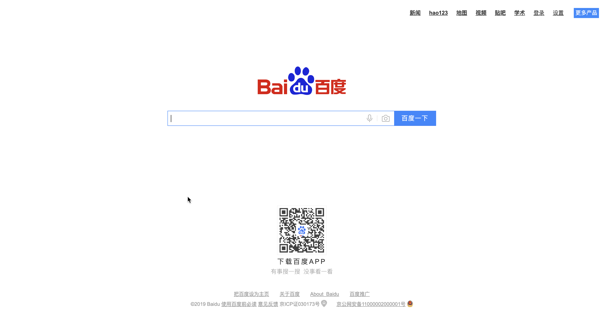
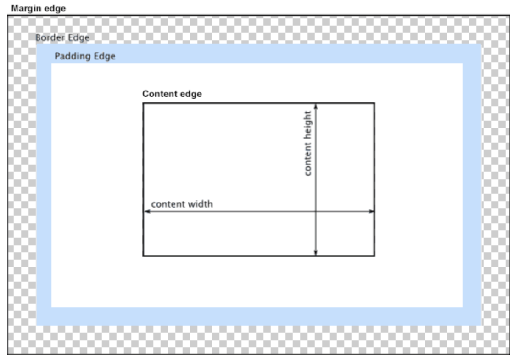
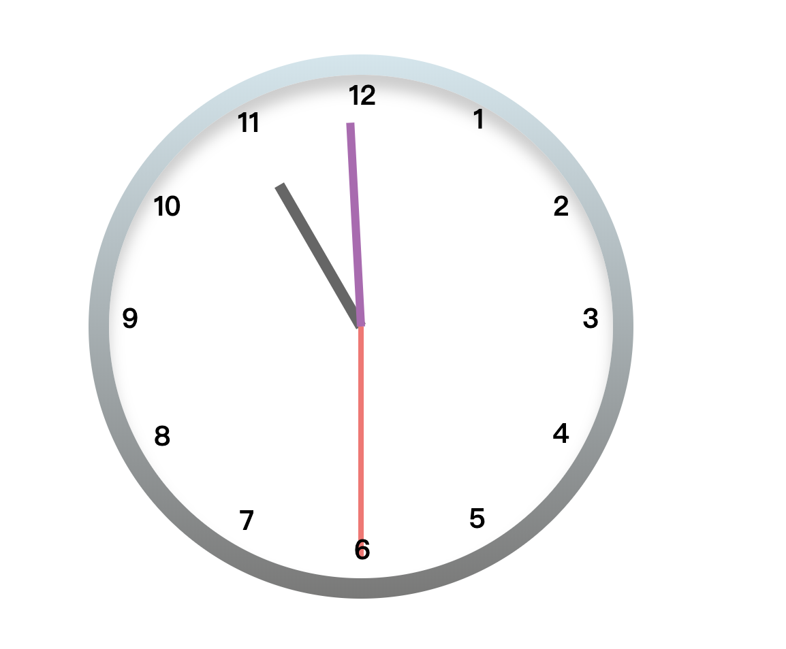
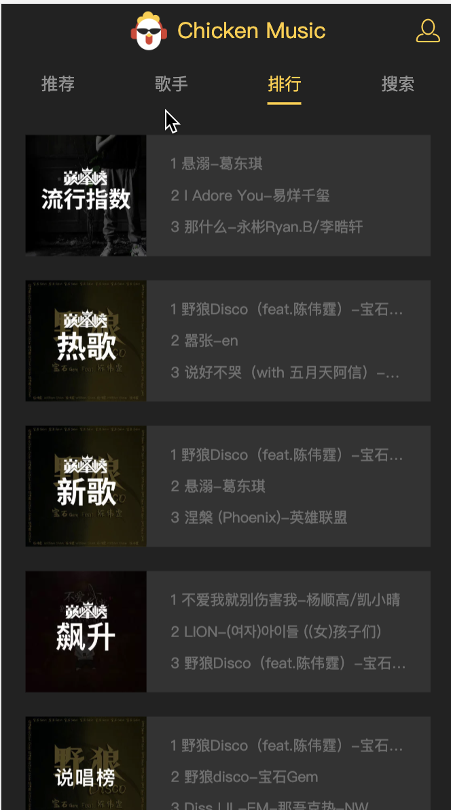

主播是从业一线的前端开发者，目前服务于某大型互联网公司，
每天晚上9点会开直播讲解前端，弹幕可以和我互动，包括技术难题。主播的

- [个人博客](http://www.liuweibo.cn/)
- [github](https://github.com/weibozzz)

## 直播日记
[MDN](https://developer.mozilla.org/zh-CN/docs/Web/JavaScript)
### 0922 直播第一天
[录播地址](https://www.bilibili.com/video/av73087610)
带着大家不到一小时，从零基础100行代码写了一个百度,昨天没看的可以看录播~

### 0923 直播第二天
[录播地址](https://www.bilibili.com/video/av73195361)
直播内容，会带大家了解网页的历史，深入了解html,css px,em,rem区别~

### 0924 直播第三天

[录播地址](https://www.bilibili.com/video/av73296107)
会带大家了解git,github的使用 实战项目 div小时钟(为了巩固前两天所学和新的知识（定位和浮动）)~

- [git历史和原理](https://weibozzz.github.io/#/./docs/%E5%B7%A5%E5%85%B7/git%E5%8E%86%E5%8F%B2%E5%92%8C%E5%8E%9F%E7%90%86)
- [git了解](https://weibozzz.github.io/#/./docs/工具/你想要的git都有)
#### usage
- `git clone https://github.com/Weibozzz/online-class.git` 克隆代码
- `git pull` 拉代码
- `git add .` 
- `git commit -m 'msg'`
- `git push`

### 0925 直播第四天

[录播地址](https://www.bilibili.com/video/av73397612)
对昨天的div小时钟完善，并学习设计的新东西
[文档笔记](./docs/date_dom.md)

### 0926 直播第五天

学习js中变量，数据类型，函数
明日直播内容 数组的方法学习,循环 vue介绍
最终实战项目：qq音乐 播放器

今天ig比赛早点下播

## 直播计划

[每晚9点直播](http://live.bilibili.com/21660572)
- 第一阶段 html css(实战项目div时钟)(目前阶段)
- 第二阶段 js,es6（计算器）
- 第三阶段 vue react (qq音乐播放器)
- 第四阶段 webpack nodejs mysql
- 第五阶段 axios,redux源码
实战项目多多，从项目中学习～
直播通知相关资料qq群: 831455187
