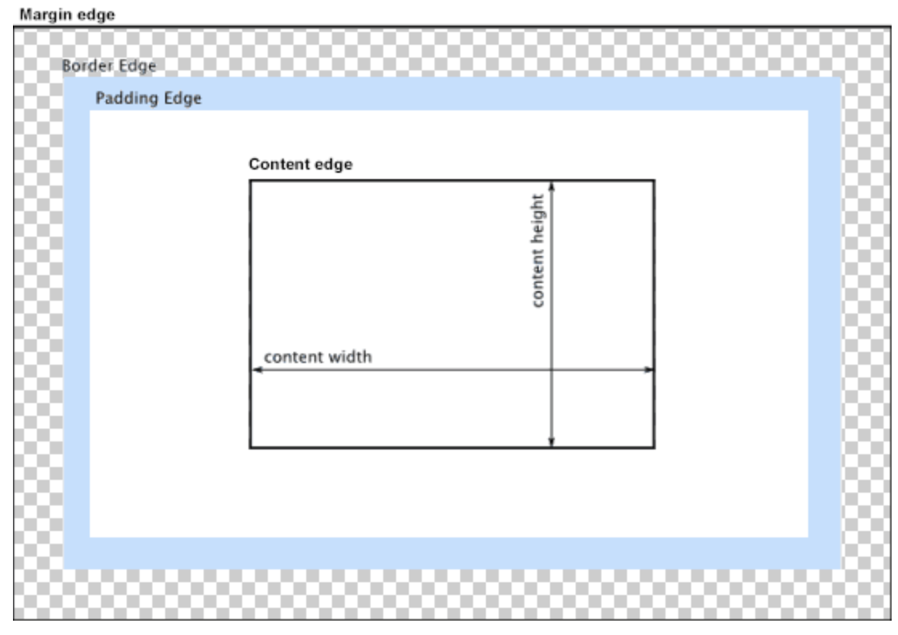

web页面的组成

- html
- css
- javascript(没讲)
  - ecma
  - dom
  - Bom

## 盒模型

[CSS](https://developer.mozilla.org/en-US/docs/Web/CSS) 中的 **box-sizing** 属性定义了 [user agent](https://developer.mozilla.org/en-US/docs/Glossary/user_agent) 应该如何计算一个元素的总宽度和总高度。

在 [CSS 盒子模型](https://developer.mozilla.org/en-US/docs/CSS/Box_model)的默认定义里，你对一个元素所设置的 [`width`](https://developer.mozilla.org/zh-CN/docs/Web/CSS/width) 与 [`height`](https://developer.mozilla.org/zh-CN/docs/Web/CSS/height) 只会应用到这个元素的内容区。如果这个元素有任何的 [`border`](https://developer.mozilla.org/zh-CN/docs/Web/CSS/border) 或 [`padding`](https://developer.mozilla.org/zh-CN/docs/Web/CSS/padding) ，绘制到屏幕上时的盒子宽度和高度会加上设置的边框和内边距值。这意味着当你调整一个元素的宽度和高度时需要时刻注意到这个元素的边框和内边距。当我们实现响应式布局时，这个特点尤其烦人。

当对一个文档进行布局（lay out）的时候，浏览器的渲染引擎会根据标准之一的 **CSS 基础框盒模型**（**CSS basic box model**），将所有元素表示为一个个矩形的盒子（box）。CSS 决定这些盒子的大小、位置以及属性（例如颜色、背景、边框尺寸…）。

每个盒子由四个部分（或称*区域*）组成，其效用由它们各自的边界（Edge）所定义（原文：defined by their respective edges，可能意指容纳、包含、限制等）。如图，与盒子的四个组成区域相对应，每个盒子有四个边界：*内容边界* *Content edge*、*内边距边界* *Padding Edge*、*边框边界* *Border Edge*、*外边框边界* *Margin Edge*。

box-sizing 属性可以被用来调整这些表现:

- `content-box`  是默认值。如果你设置一个元素的宽为100px，那么这个元素的内容区会有100px 宽，并且任何边框和内边距的宽度都会被增加到最后绘制出来的元素宽度中。
- `border-box` 告诉浏览器：你想要设置的边框和内边距的值是包含在width内的。也就是说，如果你将一个元素的width设为100px，那么这100px会包含它的border和padding，内容区的实际宽度是width减去(border + padding)的值。大多数情况下，这使得我们更容易地设定一个元素的宽高。

### 属性值[节](https://developer.mozilla.org/zh-CN/docs/Web/CSS/box-sizing#Values)

- `content-box`

  默认值，标准盒子模型。 [`width`](https://developer.mozilla.org/zh-CN/docs/Web/CSS/width) 与 [`height`](https://developer.mozilla.org/zh-CN/docs/Web/CSS/height) 只包括内容的宽和高， 不包括边框（border），内边距（padding），外边距（margin）。注意: 内边距、边框和外边距都在这个盒子的外部。 比如说，`.box {width: 350px; border: 10px solid black;}` 在浏览器中的渲染的实际宽度将是 370px。  尺寸计算公式：

  `width` = 内容的宽度

  `height` = 内容的高度

  宽度和高度的计算值都不包含内容的边框（border）和内边距（padding）。

- `border-box`

  [`width`](https://developer.mozilla.org/zh-CN/docs/Web/CSS/width) 和 [`height`](https://developer.mozilla.org/zh-CN/docs/Web/CSS/height) 属性包括内容，内边距和边框，但不包括外边距。这是当文档处于 Quirks模式 时Internet Explorer使用的[盒模型](https://developer.mozilla.org/en-US/docs/CSS/Box_model)。注意，填充和边框将在盒子内 , 例如, `.box {width: 350px; border: 10px solid black;}` 导致在浏览器中呈现的宽度为350px的盒子。内容框不能为负，并且被分配到0，使得不可能使用border-box使元素消失。  尺寸计算公式：

  *width = border + padding + 内容的宽度*

  *height = border + padding + 内容的高度*
  
## margin padding

- Margin-left
- Marfin-right
- margin-top
- Margin-bottom
- margin: 上 有 下 左；

### 例子

margin: 2px 3px 4px ;

## px em rem 区别

浏览器默认像素16px

1. em是相对于他父级元素的倍数大小

2. rem是相对于根节点html倍数大小

